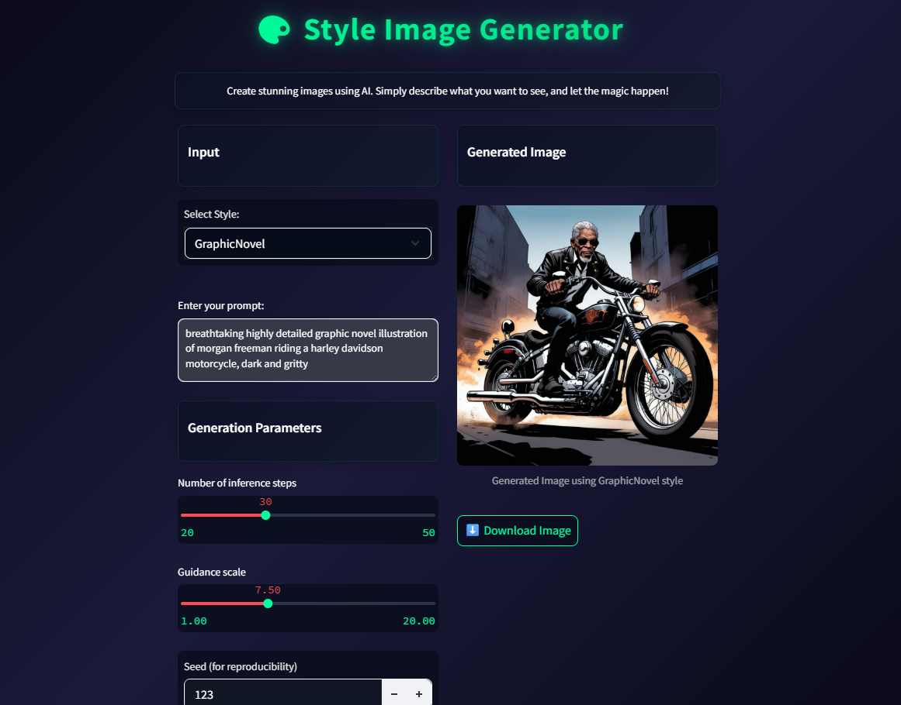

# Text to Image Generator

<div align="center">
  
  <br>
  <em>AI-powered image generation with Stable Diffusion</em>
</div>

## Available Styles

<div align="center">
  <table>
    <tr>
      <td align="center">
        
        <br>
        <b>HiDream</b>
        <br>
        <em>3D Floating Head Style</em>
      </td>
      <td align="center">
        
        <br>
        <b>Disney</b>
        <br>
        <em>Disney Animation Style</em>
      </td>
      <td align="center">
        
        <br>
        <b>Flux</b>
        <br>
        <em>Vector Journey Style</em>
      </td>
    </tr>
    <tr>
      <td align="center">
        
        <br>
        <b>Text to Image</b>
        <br>
        <em>Realistic Style</em>
      </td>
      <td align="center">
        
        <br>
        <b>Clay Animation</b>
        <br>
        <em>Clay Art Style</em>
      </td>
      <td align="center">
        
        <br>
        <b>Storyboard Sketch</b>
        <br>
        <em>Sketch Style</em>
      </td>
    </tr>
    <tr>
      <td align="center" colspan="3">
        
        <br>
        <b>Graphic Novel</b>
        <br>
        <em>Comic Book Style</em>
      </td>
    </tr>
  </table>
</div>

This application uses the FLUX-dev-lora-Vector-Journey model to generate images from text prompts. It features a modern, responsive UI built with Streamlit and uses Stable Diffusion for image generation.

## Technologies Used

### Core Technologies
- Python 3.8+
- CUDA-capable GPU (recommended for faster generation)

### Frontend
- Streamlit 1.30.0+ - Modern web interface
- Custom CSS for enhanced UI/UX
- Responsive design with dark theme

### Backend & AI
- PyTorch 2.0.0+ - Deep learning framework
- Diffusers 0.24.0+ - Stable Diffusion pipeline
- Transformers 4.36.0+ - Model architecture
- Accelerate 0.25.0+ - Performance optimization
- Safetensors 0.4.0+ - Model loading
- Hugging Face Hub 0.23.0+ - Model management

### Model
- Base Model: Stable Diffusion v1.5 (runwayml/stable-diffusion-v1-5)
- Fine-tuned Model: FLUX-dev-lora-Vector-Journey.safetensors

## Setup

1. Install the required dependencies:
```bash
pip install -r requirements.txt
```

2. Make sure your model file is in the `models` directory:
- `models/FLUX-dev-lora-Vector-Journey.safetensors`

## Running the Application

1. Start the Streamlit application:
```bash
streamlit run streamlit_app.py
```

2. Open your web browser and navigate to the URL shown in the Streamlit output (typically http://localhost:8501)

## Usage

1. Enter your text prompt in the text area
2. Adjust generation parameters:
   - Number of inference steps (20-100)
   - Guidance scale (1.0-20.0)
3. Click the "Generate Image" button
4. Wait for the image to be generated
5. Download the generated image using the download button

## Features

- Modern dark theme UI
- Real-time image generation
- Adjustable generation parameters
- Image download functionality
- Loading animations
- Responsive design
- Error handling and user feedback

## Requirements

- Python 3.8 or higher
- CUDA-capable GPU (recommended)
- See requirements.txt for all Python dependencies 