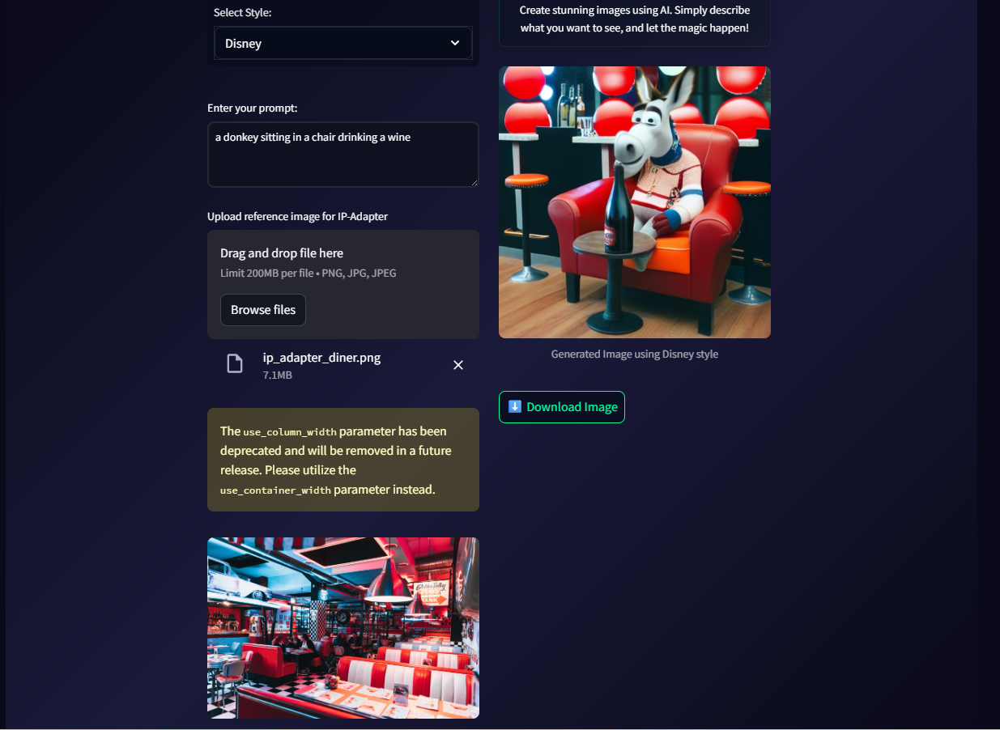

# Text to Image Generator

<div align="center">
  
  <br>
  <em>AI-powered image generation with Stable Diffusion and IP-Adapter</em>
</div>

This application uses Stable Diffusion XL with IP-Adapter to generate images from text prompts and reference images. It features a modern, responsive UI built with Streamlit and supports both text-to-image and image-to-image generation with style transfer capabilities.

## Technologies Used

### Core Technologies
- Python 3.8+
- CUDA-capable GPU (recommended for faster generation)

### Frontend
- Streamlit 1.30.0+ - Modern web interface
- Custom CSS for enhanced UI/UX
- Responsive design with dark theme

### Backend & AI
- PyTorch 2.0.0+ - Deep learning framework
- Diffusers 0.24.0+ - Stable Diffusion pipeline
- Transformers 4.36.0+ - Model architecture
- Accelerate 0.25.0+ - Performance optimization
- Safetensors 0.4.0+ - Model loading
- Hugging Face Hub 0.23.0+ - Model management

### Models
- Base Model: Stable Diffusion XL (stabilityai/stable-diffusion-xl-base-1.0)
- IP-Adapter: h94/IP-Adapter (sdxl_models/ip-adapter_sdxl.bin)
- Various LoRA fine-tuned models for different styles

## Setup

1. Install the required dependencies:
```bash
pip install -r requirements.txt
```

2. Set up your Hugging Face token:
```bash
export HUGGINGFACE_TOKEN=your_token_here
```

3. Make sure your model files are in the `models` directory:
- `models/disney_style_xl.safetensors`
- `models/joco.safetensors`
- `models/pytorch_lora_weights.safetensors`
- `models/ClayAnimationRedmond15-ClayAnimation-Clay.safetensors`
- `models/Storyboard_sketch.safetensors`
- `models/Graphic_Novel_Illustration-000007.safetensors`

## Running the Application

1. Start the Streamlit application:
```bash
streamlit run streamlit_app.py
```

2. Open your web browser and navigate to the URL shown in the Streamlit output (typically http://localhost:8501)

## Usage

### Text to Image Generation
1. Select a style from the dropdown menu
2. Enter your text prompt in the text area
3. (Optional) Upload a reference image for IP-Adapter
4. Adjust generation parameters:
   - Image dimensions (256-1024)
   - Number of inference steps (20-100)
   - Guidance scale (1.0-20.0)
   - IP-Adapter influence (0.0-1.0)
5. Click the "Generate Image" button
6. Wait for the image to be generated
7. Download the generated image using the download button

### Image to Image Generation
1. Select a style from the dropdown menu
2. Upload an input image to transform
3. Enter your text prompt for guidance
4. (Optional) Upload a reference image for IP-Adapter
5. Adjust generation parameters:
   - Image dimensions (256-1024)
   - Number of inference steps (20-100)
   - Guidance scale (1.0-20.0)
   - Transformation strength (0.0-1.0)
   - IP-Adapter influence (0.0-1.0)
6. Click the "Transform Image" button
7. Wait for the image to be generated
8. Download the transformed image using the download button

## Features

- Modern dark theme UI
- Real-time image generation
- IP-Adapter support for style transfer
- Adjustable generation parameters
- Image size preview
- Image download functionality
- Loading animations
- Responsive design
- Error handling and user feedback

## Requirements

- Python 3.8 or higher
- CUDA-capable GPU (recommended)
- See requirements.txt for all Python dependencies 